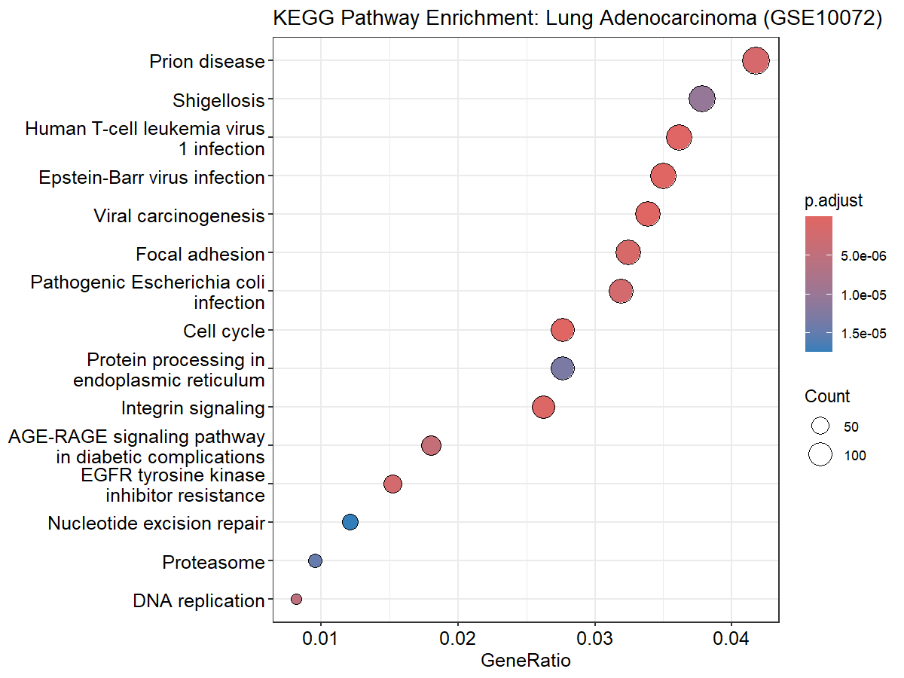
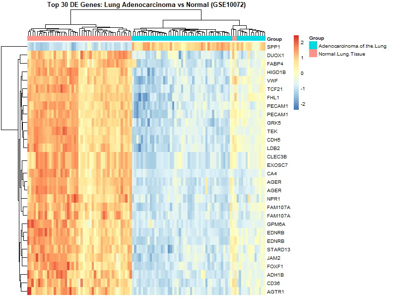

# DEG Pathway Pipeline

A reusable R pipeline for differential gene expression (DEG) analysis and
pathway enrichment from GEO microarray datasets. Wraps GEO retrieval,
limma-based DEG testing, and GO/KEGG enrichment into two functions
(`run_deg_analysis()` and `run_enrichment()`) that can be applied to any
compatible GEO series without duplicating pipeline logic.

## Attribution

The core DEG workflow (GEO retrieval, log2 normalization check, limma fit,
probe annotation) follows standard limma/GEOquery methodology widely used
in microarray analysis tutorials. The pathway enrichment step, multi-dataset
refactor into reusable functions, local-file fallback, volcano plot, and
heatmap are original additions on top of that base workflow.

## Pipeline overview

1. **`run_deg_analysis()`**: downloads (or loads locally) a GEO series,
   checks whether log2 transformation is needed, builds a group/design
   matrix from sample metadata, fits a linear model with `limma`, and
   annotates significant probes with gene symbols.
2. **`run_enrichment()`**: takes the DEG table and tests for over-represented
   GO biological processes and KEGG pathways using `clusterProfiler`.
3. Visualization: volcano plot (labeled top up/down genes), heatmap of the
   top significant genes, and GO/KEGG dotplots.

## Example: GSE10072, lung adenocarcinoma vs. normal lung tissue

Affymetrix HG-U133A microarray data comparing lung adenocarcinoma tissue to
normal lung tissue (`hgu133a.db` annotation). Contrast is set explicitly as
tumor vs. normal (`Adenocarcinoma.of.the.Lung` vs. `Normal.Lung.Tissue`) so
positive logFC means higher expression in tumor.

**Result:** 9,552 significant probes at `adj.P.Val < 0.01`.

### Volcano plot



Highlights genes with `|logFC| > 1` and `adj.P.Val < 0.01`. Top 8 up- and
top 8 down-regulated genes are labeled separately per direction, since the
most statistically significant genes skewed toward down-regulated and would
otherwise crowd out the up-regulated side.

Top down-regulated genes include `FAM107A`, `CD36`, `GRK5`, `CDH5`, `EDNRB`,
consistent with loss of normal lung vasculature and endothelial markers in
tumor tissue. Top up-regulated genes include `SPP1`, `NME1`, `HMGB3`, genes
commonly associated with tumor progression.

### Heatmap



Top 30 significant genes, clustered by sample. Tumor and normal samples
separate clearly into distinct expression blocks.

### KEGG pathway enrichment


Top enriched pathways include cell cycle, focal adhesion, viral
carcinogenesis, and integrin signaling, pathways broadly associated with
proliferation and tissue remodeling in cancer.

## Known issues and notes

- GEO's automatic download for GSE10072 was unreliable (repeated connection
  failures). `run_deg_analysis()` supports a `local_file` argument as a
  fallback: download the series matrix manually and pass its path;
  `getGPL = FALSE` is used since gene annotation comes from `hgu133a.db`
  instead.
- Large Bioconductor annotation packages (`org.Hs.eg.db`, `hgu133a.db`,
  `illuminaHumanv4.db`) can exceed R's default 60-second download timeout;
  the script sets `options(timeout = 600)`.

## Usage

```r
result <- run_deg_analysis(
  gse_id            = "GSEXXXXX",
  group_meta_column = "source_name_ch1",   # check pData(gset) for the right column
  annotation_db     = hgu133a.db,           # match the platform used
  contrast_groups   = c("GroupA", "GroupB"),
  p_cutoff          = 0.01,
  dataset_label     = "My dataset"
)

enrichment <- run_enrichment(result$deg_table)
```

## Requirements

R 4.4+, Bioconductor 3.20. See `deg_analysis.R` for the full package list.